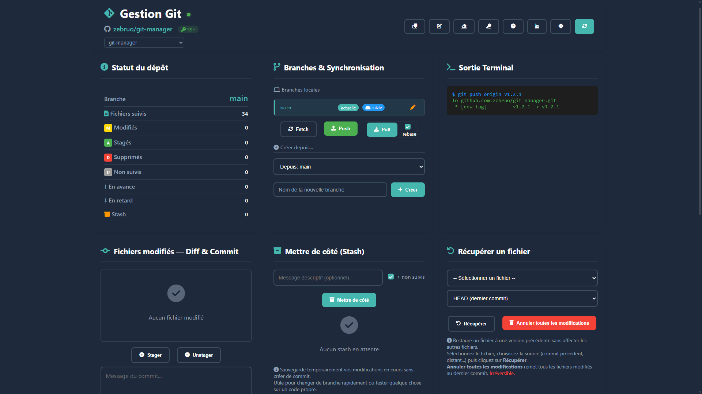
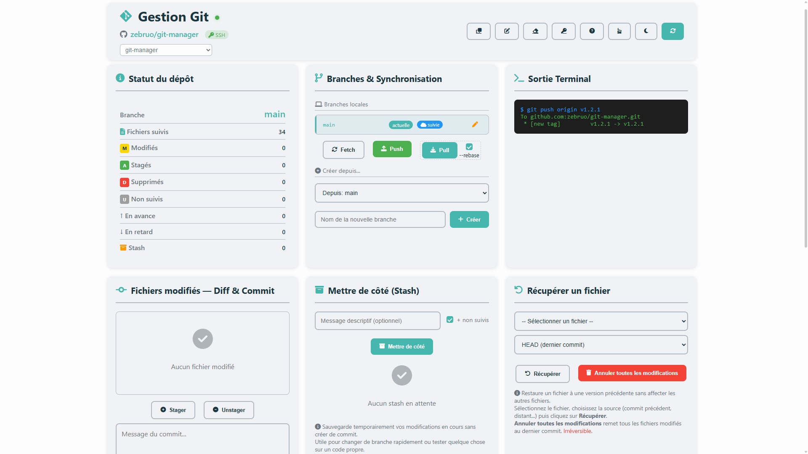
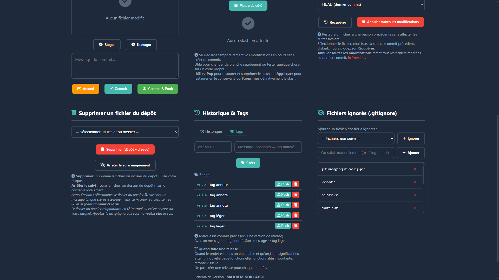
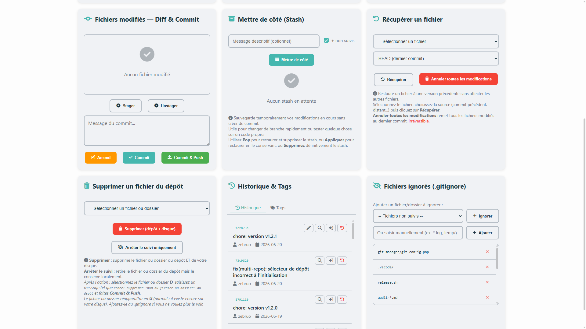

# Git Manager

Interface web pour gérer un dépôt Git sans ligne de commande.

## Interface

| Mode sombre | Mode clair |
|---|---|
|  |  |
|  |  |

## Fichiers

| Fichier | Description |
|---------|-------------|
| `git-manager.html` | Interface principale |
| `git-api.php` | Point d'entrée API — dispatche vers les modules dans `api/` |
| `git-config.example.php` | Modèle de configuration (à copier en `git-config.php`) |
| `git-config.php` | Configuration personnelle — non versionné (identité Git, clé SSH) |
| `git-auth.html` | Configuration de l'authentification SSH / Token |
| `git-clone.html` | Clonage d'un dépôt distant |
| `git-reset-remote.html` | Réinitialisation du remote origin |
| `git-help.html` | Documentation d'aide (chargée dans l'interface principale) |
| `index.html` | Page d'accueil du dossier git-manager |
| `flavicon.svg` | Icône SVG du projet |

### Modules backend (`api/`)

| Fichier | Actions gérées |
|---------|----------------|
| `api/branches.php` | branches, switchBranch, createBranch, renameBranch, deleteBranch, mergeBranch, pushBranch, deleteRemoteBranch |
| `api/commits.php` | log, fileLog, stageFiles, unstageFiles, commit, commitAndPush, revertCommit, amendLastCommit, showCommit, diff |
| `api/files.php` | checkout, discardAll, checkoutCommit, removeFromRepo, untrackFile, fileDiff |
| `api/gitignore.php` | getGitignore, addToGitignore, removeFromGitignore |
| `api/setup.php` | checkRepo, clone, initRepo, listFolders, listRemoteBranches, resetRemote |
| `api/stash.php` | stashList, stashSave, stashApply, stashDrop |
| `api/status.php` | status, repoInfo, addRemote, removeRemote |
| `api/sync.php` | push, pull, fetch |
| `api/tags.php` | listTags, createTag, deleteTag, pushTag, deleteRemoteTag |
| `api/repos.php` | listRepos |

### Feuilles de style (`css/`)

| Fichier | Description |
|---------|-------------|
| `css/common.css` | Variables CSS partagées (`:root`, `.dark-mode`), scrollbar, alertes toast, checkbox |
| `css/pages-shared.css` | Layout commun des pages secondaires (header, container, card) |
| `css/git-manager.css` | Styles de l'interface principale |
| `css/git-help.css` | Styles de la modale d'aide |
| `css/git-auth.css` | Styles de la page authentification |
| `css/git-clone.css` | Styles de la page clonage |
| `css/git-reset-remote.css` | Styles de la page réinitialisation |
| `css/index.css` | Styles de la page d'accueil |

### Scripts frontend (`js/`)

| Fichier | Description |
|---------|-------------|
| `js/common.js` | Fonctions partagées entre toutes les pages : dark mode, alertes toast |
| `js/git-manager.js` | Logique de l'interface principale |
| `js/git-auth.js` | Logique de la page authentification |
| `js/git-clone.js` | Logique de la page clonage |
| `js/git-reset-remote.js` | Logique de la page réinitialisation |

## Fonctionnalités

### Initialisation et configuration

- **Cloner / créer un dépôt** : Cloner un dépôt existant (HTTPS/SSH) ou créer un dépôt vierge dans `reposRoot` via `git-clone.html`
- **Lier à GitHub** : Configurer le remote origin vers un dépôt GitHub
- **Modifier/Supprimer le remote** : Changer ou retirer la liaison GitHub
- **Authentification SSH** : Générer et configurer une clé SSH pour GitHub

### Statut du dépôt

- Branche courante
- Nombre de fichiers suivis (total des fichiers trackés par Git)
- Fichiers modifiés (M), stagés (A), supprimés (D), non suivis (U)
- Commits en avance/retard par rapport au remote
- Nombre de stashes en attente
- Détection du HEAD détaché

### Fichiers modifiés — Diff & Commit

- **Sélection des fichiers** : Cocher les fichiers à inclure
- **Tout sélectionner** : Sélectionner tous les fichiers d'un coup
- **Diff visuel** : Cliquer sur le nom d'un fichier M, A ou D ouvre une modale avec les modifications ligne par ligne :
  - Tableau à 3 colonnes : numéro ancien / numéro nouveau / contenu
  - Lignes supprimées en rouge, ajoutées en vert
  - Fichiers M et A : deux onglets **Non stagé** / **Stagé** si les deux zones sont remplies simultanément
  - Bouton **Copier** pour copier le diff brut dans le presse-papiers
- **Commit** : Enregistrer les modifications localement
- **Commit & Push** : Commit + envoi vers GitHub en une action
- **Amend** : Modifier le dernier commit — trois usages combinables :
  - Ajouter des fichiers oubliés (cocher avant de cliquer Amend)
  - Changer le message (saisir un nouveau message dans le champ)
  - Inclure des fichiers déjà stagés (pris automatiquement, sans re-sélection)
  - Charger le message actuel via le bouton crayon dans l'historique pour l'éditer
  - Avertissement automatique si le commit a déjà été pushé (push --force requis)
- **Historique** : Liste des 20 derniers commits avec hash, message, auteur et date
- **Détail d'un commit** : Affiche les fichiers modifiés et les statistiques (`git show --stat`)
- **Revert** : Annuler un commit en créant un nouveau commit inverse
- **Checkout sur un commit** : Se placer sur un ancien commit (HEAD détaché)
- **Créer une branche depuis un HEAD détaché** : Sauvegarder un état exploré dans une nouvelle branche

### Tags

- **Créer** : Tag léger (nom seul) ou annoté (nom + message). Convention recommandée : `MAJOR.MINOR.PATCH`
- **Push** : Envoyer le tag vers GitHub (nécessaire pour créer une release). Sans effet si déjà publié.
- **Supprimer** : Suppression locale + tentative distante automatique (ignorée si jamais pushé)
- Tags accessibles depuis l'onglet **Tags** de la card Historique & Tags

### Gestion des branches

| Action | Description |
|--------|-------------|
| Créer | Nouvelle branche à partir de la branche en cours, d'une autre branche locale, d'une branche distante ou d'un hash/ref précis |
| Branche orpheline | Branche vide sans fichiers et sans historique |
| Nouveau départ | Branche avec les fichiers actuels mais sans historique |
| Renommer | Changer le nom d'une branche (local et distant si publiée). La branche par défaut (main/master) ne peut pas être renommée |
| Basculer | Changer de branche active (préserve les fichiers non suivis) |
| Fusionner | Intégrer une branche dans la branche courante |
| Publier | Envoyer une branche locale vers GitHub |
| Supprimer | Supprimer localement (et optionnellement sur GitHub) |

### Mettre de côté (Stash)

- **Mettre de côté** : Sauvegarde temporairement les modifications en cours sans commit
- **Pop** : Restaure les modifications et supprime le stash
- **Appliquer** : Restaure les modifications en conservant le stash
- **Supprimer** : Supprime un stash définitivement
- Option pour inclure ou exclure les fichiers non suivis
- Message descriptif optionnel

### Synchronisation

- **Push** : Envoyer les commits vers GitHub (détecte automatiquement le premier push)
- **Pull** : Récupérer et fusionner les modifications depuis GitHub (option `--rebase`)
- **Fetch** : Vérifier les nouveautés sans modifier les fichiers locaux

### Récupération de fichiers

- Accès rapide : HEAD, HEAD~1, HEAD~2, origin/main
- Historique complet : liste des commits du fichier sélectionné
- Annuler toutes les modifications locales

### Suppression de fichiers

- **Supprimer (dépôt + disque)** : Supprime le fichier ou le dossier complètement (`git rm -r`)
- **Arrêter le suivi** : Retire du dépôt mais conserve sur le disque (`git rm --cached -r`)
- Sélection par fichier individuel ou par dossier entier

### Gestion du .gitignore

- Voir la liste des patterns ignorés
- Ajouter un fichier non suivi au .gitignore
- Ajouter un pattern personnalisé (ex: `*.log`, `temp/`)
- Retirer un pattern du .gitignore

### Multi-dépôts

Permet de basculer entre plusieurs dépôts Git depuis le même navigateur, sans changer de virtual host.

- **Sélecteur** : menu déroulant affiché dans le header, alimenté par `reposRoot`
- **Scan** : liste uniquement les sous-dossiers directs de `reposRoot` qui contiennent un `.git/`
- **Navigation** : le paramètre `?repo=<nom>` dans l'URL identifie le dépôt actif et est propagé aux pages secondaires
- **Sécurité** : chaque chemin est validé avec `realpath()` pour éviter toute traversée de répertoire

### Interface

- **Mode sombre** : Thème clair/sombre avec mémorisation
- **Terminal** : Affichage des commandes Git exécutées
- **Notifications** : Toasts en bas à droite (succès, erreur, avertissement)
- **Aide intégrée** : Documentation accessible depuis l'interface

## Pages auxiliaires

### git-auth.html - Authentification SSH / Token HTTPS

Guide de configuration pour accéder à GitHub (push, pull, fetch). Deux méthodes disponibles :

**SSH** (recommandé pour un usage régulier) :
- Génération de clé RSA ou ED25519
- Ajout de la clé à l'agent SSH et à GitHub
- Test de connexion (`ssh -T git@github.com`)

**Token HTTPS** (usage occasionnel, CI/CD) :
- Création d'un Personal Access Token (PAT) sur GitHub
- Utilisation du token dans l'URL ou via le Credential Manager

### git-clone.html - Clonage et création de dépôt

Deux actions disponibles, les deux créent le dépôt dans `reposRoot` :
- **Cloner** : copie un dépôt distant (HTTPS ou SSH) en local — le dépôt apparaît immédiatement dans le sélecteur
- **Créer un dépôt vierge** : saisir un nom, un dossier est créé et `git init -b main` est lancé automatiquement

### git-help.html - Documentation d'aide

Contenu HTML de l'aide intégrée, organisé en 5 chapitres :

- **Mise en place** : authentification SSH/Token, clonage, création de dépôt, multi-dépôts
- **Travail quotidien** : synchronisation (remote, push, pull, fetch), statuts des fichiers, diff visuel, stash
- **Gérer les commits** : commit, amend, revert, HEAD détaché, récupération de fichiers, actions dangereuses
- **Branches** : créer, basculer, fusionner, rebaser, fork et contribution
- **Versioning & maintenance** : tags, gitignore, workflow typique, exercices pratiques

### git-reset-remote.html - Réinitialisation du remote

Crée une nouvelle branche vide (sans historique) et supprime les branches sélectionnées sur GitHub. **Irréversible.**

## Configuration

1. Renommez `git-config.example.php` en `git-config.php`
2. Renseigner vos informations :

```php
<?php
return [
    'userName' => 'votre-username',
    'userEmail' => 'votre-email@example.com',
    'sshKeyPath' => 'C:/Users/votre-nom/.ssh/id_rsa',  // ou id_ed25519

    // Dossier contenant vos dépôts Git (n'importe où sur le disque)
    'reposRoot' => 'C:/Users/votre-nom/mes-projets',

    'options' => [
        'maxHistoryItems' => 20,    // Nombre de commits dans l'historique
        'maxFileLogItems' => 10,    // Nombre de commits par fichier (récupération)
    ]
];
```

> **Note :** `git-config.php` contient des données personnelles et est automatiquement ajouté au `.gitignore`. Ne le partagez pas.

## Installation

1. Copiez le dossier `git-manager/` dans le dossier public de votre serveur (`htdocs/`, `www/`, `public_html/`…)
2. Renommez `git-config.example.php` en `git-config.php` et renseignez vos informations
3. Accédez à `http://localhost/git-manager/`

> Si git-manager est placé en dehors du dossier public du serveur, créez un virtual host Apache pointant vers ce dossier.

**Mise à jour** : Remplacez le dossier `git-manager/` par la nouvelle version. Votre `git-config.php` n'est pas inclus dans les releases — recopiez-le manuellement.

```
(htdocs/, www/, etc.)/         <- dossier public du serveur
├── git-manager/               <- l'application (pas de .git/ → ignoré)
└── ...

mes-projets/                   <- reposRoot (n'importe où sur le disque)
├── project-a/                 <- détecté automatiquement dans le sélecteur
│   └── .git/
└── project-b/                 <- détecté automatiquement dans le sélecteur
    └── .git/
```

git-manager trouve les dépôts via `reposRoot`.

## Prérequis

- Serveur web avec PHP
- Git installé sur le serveur
- Droits d'écriture sur le dossier du projet
- (Optionnel) OpenSSH pour l'authentification par clé SSH

## Compatibilité testée

- **PHP** : 8.x
- **Navigateurs** : Chrome, Firefox, Edge, Safari (dernières versions)
- **OS** : Windows 10/11, macOS, Linux

## Licence

Usage personnel — Tous droits réservés.

---

## A propos

Git Manager est une interface web pour gérer un dépôt Git sans ligne de commande. Ce projet est opérationnel, à usage personnel, sans contributions externes. Il a été développé avec l'assistance de [Claude](https://claude.ai) (Anthropic).

**Il est recommandé de faire un premier essai sur un dépôt test avant de l'utiliser sur un projet existant.**

*Version : v1.3.0 — Juin 2026*
